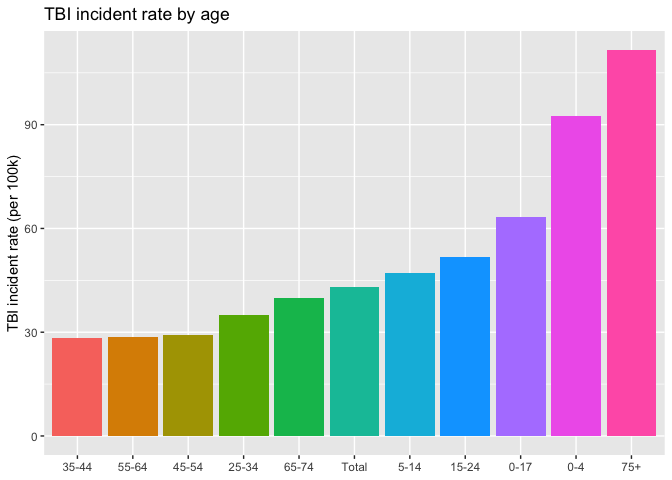
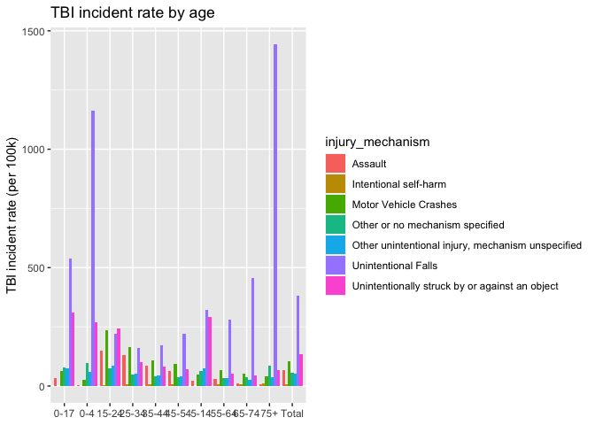

Portfolio 3 - Tidy Tuesday TBIs
================
Lindsay
4/5

``` r
library(tidyverse)
```

    ## ── Attaching core tidyverse packages ──────────────────────── tidyverse 2.0.0 ──
    ## ✔ dplyr     1.1.0     ✔ readr     2.1.4
    ## ✔ forcats   1.0.0     ✔ stringr   1.5.0
    ## ✔ ggplot2   3.4.1     ✔ tibble    3.2.1
    ## ✔ lubridate 1.9.2     ✔ tidyr     1.3.0
    ## ✔ purrr     1.0.1     
    ## ── Conflicts ────────────────────────────────────────── tidyverse_conflicts() ──
    ## ✖ dplyr::filter() masks stats::filter()
    ## ✖ dplyr::lag()    masks stats::lag()
    ## ℹ Use the ]8;;http://conflicted.r-lib.org/conflicted package]8;; to force all conflicts to become errors

``` r
# Get the Data

tbi_age <- readr::read_csv('https://raw.githubusercontent.com/rfordatascience/tidytuesday/master/data/2020/2020-03-24/tbi_age.csv')
```

    ## Rows: 231 Columns: 5
    ## ── Column specification ────────────────────────────────────────────────────────
    ## Delimiter: ","
    ## chr (3): age_group, type, injury_mechanism
    ## dbl (2): number_est, rate_est
    ## 
    ## ℹ Use `spec()` to retrieve the full column specification for this data.
    ## ℹ Specify the column types or set `show_col_types = FALSE` to quiet this message.

``` r
tbi_year <- readr::read_csv('https://raw.githubusercontent.com/rfordatascience/tidytuesday/master/data/2020/2020-03-24/tbi_year.csv')
```

    ## Rows: 216 Columns: 5
    ## ── Column specification ────────────────────────────────────────────────────────
    ## Delimiter: ","
    ## chr (2): injury_mechanism, type
    ## dbl (3): year, rate_est, number_est
    ## 
    ## ℹ Use `spec()` to retrieve the full column specification for this data.
    ## ℹ Specify the column types or set `show_col_types = FALSE` to quiet this message.

``` r
tbi_military <- readr::read_csv('https://raw.githubusercontent.com/rfordatascience/tidytuesday/master/data/2020/2020-03-24/tbi_military.csv')
```

    ## Rows: 450 Columns: 5
    ## ── Column specification ────────────────────────────────────────────────────────
    ## Delimiter: ","
    ## chr (3): service, component, severity
    ## dbl (2): diagnosed, year
    ## 
    ## ℹ Use `spec()` to retrieve the full column specification for this data.
    ## ℹ Specify the column types or set `show_col_types = FALSE` to quiet this message.

``` r
# Or read in with tidytuesdayR package (https://github.com/thebioengineer/tidytuesdayR)
# PLEASE NOTE TO USE 2020 DATA YOU NEED TO USE tidytuesdayR version ? from GitHub

# Either ISO-8601 date or year/week works!

# Install via devtools::install_github("thebioengineer/tidytuesdayR")

tuesdata <- tidytuesdayR::tt_load('2020-03-24')
```

    ## --- Compiling #TidyTuesday Information for 2020-03-24 ----
    ## --- There are 4 files available ---
    ## --- Starting Download ---

    ## 
    ##  Downloading file 1 of 4: `dod_tbi_2006.csv`

    ## Warning: One or more parsing issues, call `problems()` on your data frame for details,
    ## e.g.:
    ##   dat <- vroom(...)
    ##   problems(dat)

    ##  Downloading file 2 of 4: `tbi_age.csv`
    ##  Downloading file 3 of 4: `tbi_military.csv`
    ##  Downloading file 4 of 4: `tbi_year.csv`

    ## --- Download complete ---

``` r
tuesdata <- tidytuesdayR::tt_load(2020, week = 13)
```

    ## --- Compiling #TidyTuesday Information for 2020-03-24 ----
    ## --- There are 4 files available ---
    ## --- Starting Download ---

    ## 
    ##  Downloading file 1 of 4: `dod_tbi_2006.csv`

    ## Warning: One or more parsing issues, call `problems()` on your data frame for details,
    ## e.g.:
    ##   dat <- vroom(...)
    ##   problems(dat)

    ##  Downloading file 2 of 4: `tbi_age.csv`
    ##  Downloading file 3 of 4: `tbi_military.csv`
    ##  Downloading file 4 of 4: `tbi_year.csv`

    ## --- Download complete ---

``` r
tbi_age <- tuesdata$tbi_age
```

plot 1 most common tbi mechanism per age group

``` r
tbi_age %>% 
  group_by(age_group) %>% 
  summarize(total = sum(number_est, na.rm = TRUE),
            rate = round(mean(rate_est, na.rm = TRUE), 2))
```

    ## # A tibble: 11 × 3
    ##    age_group   total  rate
    ##    <chr>       <dbl> <dbl>
    ##  1 0-17       836718  63.2
    ##  2 0-4        331403  92.6
    ##  3 15-24      476652  51.6
    ##  4 25-34      319303  35.0
    ##  5 35-44      240462  28.3
    ##  6 45-54      265417  29.1
    ##  7 5-14       348913  47.1
    ##  8 55-64      241511  28.7
    ##  9 65-74      211035  40.0
    ## 10 75+        442377 112. 
    ## 11 Total     2877539  43

``` r
tbi_age %>% 
  group_by(age_group) %>% 
  summarize(rate = round(mean(rate_est, na.rm = TRUE), 2)) %>% 
  mutate(age_group = fct_reorder(age_group, rate)) %>% 
  ggplot(aes(age_group, rate, fill = age_group)) + 
  geom_col(show.legend = FALSE) +
  labs(title = "TBI incident rate by age",
       x = NULL,
       y = "TBI incident rate (per 100k)")
```

<!-- -->

``` r
tbi_age %>% 
  group_by(injury_mechanism) %>% 
  summarize(total = sum(number_est, na.rm = TRUE))
```

    ## # A tibble: 7 × 2
    ##   injury_mechanism                                    total
    ##   <chr>                                               <dbl>
    ## 1 Assault                                            492005
    ## 2 Intentional self-harm                               45103
    ## 3 Motor Vehicle Crashes                              860958
    ## 4 Other or no mechanism specified                    474609
    ## 5 Other unintentional injury, mechanism unspecified  439216
    ## 6 Unintentional Falls                               3165336
    ## 7 Unintentionally struck by or against an object    1114103

``` r
tbi_age %>% 
  group_by(age_group, injury_mechanism) %>% 
  ggplot(aes(age_group, rate_est, fill = injury_mechanism)) + 
   geom_col(position = "dodge") +
  labs(title = "TBI incident rate by age", 
       x = NULL,
       y = "TBI incident rate (per 100k)")
```

    ## Warning: Removed 11 rows containing missing values (`geom_col()`).

<!-- -->
